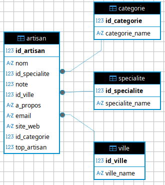

# Trouve ton artisan !

## Contexte
La région Auvergne Rhône-Alpes veux une application web qui liste les artisans et qui permet au particulier et au professionnel de prendre contacte avec eux.

## Maquette
La [maquette](https://github.com/Corentin-pqt87/trouve_ton_artisan/blob/main/trouve%20ton%20artisan.fig) est fait avec [Figma](https://www.figma.com/fr-fr/) et le fichier est disponible sur la [page GitHub du projet](https://github.com/Corentin-pqt87/trouve_ton_artisan).

Des changements ont était apporter en cours de route notamment sur le fond qui fus changer pour être en accord avec la [page officiel de l'Auvergne Rhône-Alpes](https://www.auvergnerhonealpes.fr/contenus/ladministration-regionale-et-les-offres-demploi).

## Fonctionnement interne
Le frontend est héberger sur [vercel](https://vercel.com/), le backend est héberger sur [render](render.com) et la base de donnée est héberger sur [aiven](https://aiven.io/mysql).

Des problème pour le formulaire de contact, tout les service que j'ai trouver étant payant et n'ayant trouver uniquement des méthodes qui nécessité une seul adresse de contact j'ai opté pour un `mailto` qui ouvre la messagerie avec l'adresse de l'artisan. 

> [!WARNING] Render
> L'API est héberger sur render, render met en veille l'api quand il n'y a pas d'utilisateur. Il faut donc attendre quelque seconde le temps que l'api ce lance.
### Base de données

J'utilise l'application DBeaver pour créer est ajouter des données au tables.
Vous pouvez trouver un fichier [dump](https://github.com/Corentin-pqt87/trouve_ton_artisan/blob/main/data/dump-trouve_ton_artisan-202605201732.sql) de la base de donné afin de pouvoir importer l'intégralitée de la base de donné en local.

### Sécurité
Il n'y a pas de système de connexion pour les particuliers car la notation n'était pas dans le caillé des charge. 

#### faille potentiel
Absence de limitation du nombre de requêtes.

## GitHub
[lien du repository GitHub](https://github.com/Corentin-pqt87/trouve_ton_artisan)

## lien
[Touve ton artisans (site vercel)](https://trouve-ton-artisan-lac.vercel.app/)\
[Trouve ton artisan (API render)](https://trouve-ton-artisan-api-gml4.onrender.com/)
